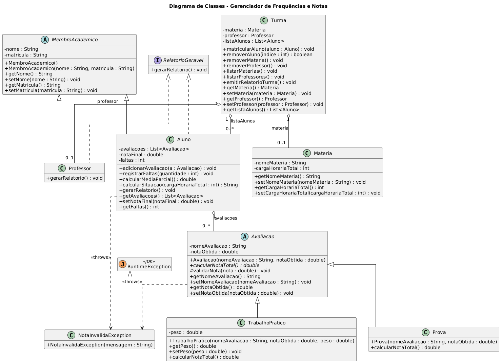

# Gerenciador de Frequencias e Notas.

 Esse projeto trata-se de um trabalho acadêmico para a matéria de POO.

 ## 1. Diagrama de Classes
 


## 2. Regras de Negócio
 
O sistema implementa as 17 regras de negócio abaixo (RN-01 a RN-17).
 
| RN | Regra de negócio |
|----|------------------|
| RN-01 | O aluno é **reprovado por falta** quando o total de faltas ultrapassa **25%** da carga horária da matéria (essa verificação tem prioridade sobre as notas). |
| RN-02 | A nota de um **Trabalho Prático** é calculada como `nota obtida × peso`; a de uma **Prova** é a própria nota. |
| RN-03 | O aluno é **Aprovado Direto** quando a média parcial é **≥ 7**. |
| RN-04 | O aluno vai para **Avaliação Final** quando a média parcial está entre **5 e 7** (5 ≤ média < 7) e ainda não há nota da final lançada. |
| RN-05 | Na avaliação final, o aluno é **Aprovado na Final** quando a **média de recuperação** `(média + nota final) / 2` é **≥ 5**. |
| RN-06 | Na avaliação final, o aluno é **Reprovado na Final** quando a **média de recuperação** `(média + nota final) / 2` é **< 5**. |
| RN-07 | O aluno é **Reprovado Direto** quando a média parcial é **< 5**. |
| RN-08 | Toda nota (de avaliação ou da final) deve estar no intervalo **[0, 10]**; valores fora disso são rejeitados com `NotaInvalidaException`. |
| RN-09 | O sistema gera **relatório de notas** individual (por aluno) e geral (da turma). |
| RN-10 | É possível **cadastrar uma matéria** na turma. |
| RN-11 | É possível **cadastrar um professor** na turma. |
| RN-12 | É possível **matricular (cadastrar) um aluno** na turma. |
| RN-13 | É possível **remover a matéria** da turma. |
| RN-14 | É possível **remover o professor** da turma. |
| RN-15 | É possível **remover um aluno** da turma pelo índice. |
| RN-16 | É possível **listar a matéria** da turma (com carga horária, limite de faltas e alunos matriculados). |
| RN-17 | É possível **listar o professor** da turma (e a matéria que ele leciona). |

## 3. Tecnologias Utilizadas
- **Java** (JDK)
- **JUnit 5** (Standalone Console para testes unitários)

## 4. Pré-requisitos
Certifique-se de ter o [Java JDK](https://www.oracle.com/java/technologies/downloads/) instalado na sua máquina e configurado nas variáveis de ambiente.

## 5. Como compilar e executar a aplicação
Para rodar o Gerenciador de Frequências e Notas (Menu Interativo), abra o terminal na raiz do projeto e execute os comandos abaixo:

```bash
# Cria a pasta bin para armazenar os arquivos compilados (se não existir)
mkdir -p bin

# Compila os arquivos de código-fonte
javac -encoding UTF-8 -d bin src/main/*.java

# Executa a classe principal
java -cp bin main.Main
````

## 6. Como executar os testes
O projeto contém testes automatizados. Para compilar e executar com JUnit, execute os seguintes comandos abaixo:
````bash
# Cria a pasta bin (caso ainda não tenha sido criada)
mkdir -p bin

# Compila o código-fonte e os testes, incluindo o .jar do JUnit no classpath
javac -encoding UTF-8 -cp lib/junit-platform-console-standalone-6.1.0.jar -d bin src/main/*.java src/test/*.java

# Executa os testes usando o JUnit Standalone
java -jar lib/junit-platform-console-standalone-6.1.0.jar execute --class-path bin --scan-class-path
````
